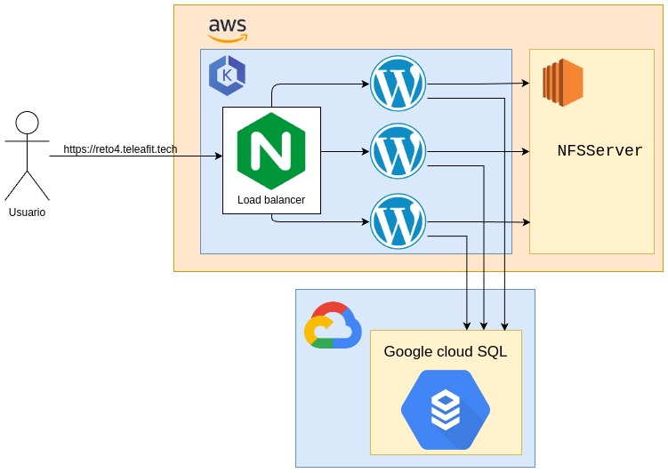

# ST0263 - Tópicos Especiales de Telemática
#
## Integrantes:
- Hobarlan Uparela Arroyo (huparelaa@eafit.edu.co)
- Julian David Valencia Restrepo (jdvalencir@eafit.edu.co)
- Andres Prada Rodriguez (apradar@eafit.edu.co)

## Profesor
- **Nombre:** Edwin Nelson Montoya Munera
- **Correo:** emontoya@eafit.edu.co

# Reto 4 - Cluster de kubernetes con wordpress, mysql y NFS

## 1. breve descripción de la actividad

En este reto realizaremos un despliegue de una aplicación Wordpress monolítica usando Docker en varios nodos, con el fin de mejorar la disponibilidad de la aplicación. Para ello, implementaremos un balanceador de cargas basado en Nginx que reciba el tráfico web https de Internet con múltiples instancias de procesamiento. Además de eso utilizamos el sistema de base de datos MySQL de la nube de google lo que yermite que se pueda cambiar fácilmente de proveedor en caso de ser requerido, incluso utilizar uno propio. Además de eso se tien un servidor NFS para almacenar los archivos de la aplicación Wordpress utilizando una instancia EC2.

### 1.1. Que aspectos cumplió o desarrolló de la actividad propuesta por el profesor (requerimientos funcionales y no funcionales)

Aspectos cumplidos de la actividad propuesta por el profesor:

* Implementación del clúster de kubernetes en AWS.
* Implementación de un balanceador de carga con Nginx.
* Alta disponibilidad de la aplicación Wordpress, alta disponibilidad de la base de datos y alta disponibilidad del servidor NFS.
* Implementación de sistema de archivos NFS.
* Implementación de certificado SSL para la página web, además de redireccionar el tráfico http a https en el dominio `https://reto4.teleafit.tech`.

### 1.2. Que aspectos NO cumplió o desarrolló de la actividad propuesta por el profesor (requerimientos funcionales y no funcionales)

* Ninguno

## 2. información general de diseño de alto nivel, arquitectura, patrones, mejores prácticas utilizadas.
Se utilizó la arquitectura presentada a continuación:



Como podemos ver en el diagrama se puede acceder a la página web por medio de `https` debido al certificado SSL obtenido, además como se puede apreciar esta dirección de internet va al balanceador de cargas el cual se encarga de distribuir las peticiones entre una instancia de wordpress y otra, finalmente vemos que ambas instancias de wordpress apuntan a la misma base de datos y NFS Server los cuales están separados del clúster de kubernetes por cuestiones fde implementación.
## 3. Descripción del ambiente de desarrollo y técnico: lenguaje de programación, librerias, paquetes, etc, con sus numeros de versiones.

Se utilizó el servicio EKS de AWS para la orquestación de Kubernetes, permitiendo así una fácil escalabilidad y administración de los contenedores. Además, se utilizó el servicio SQL de Google Cloud Platform para la base de datos MySQL, permitiendo una fácil administración de la base de datos. Por último, se utilizó un servidor NFS en una instancia EC2 de AWS para almacenar los archivos de la aplicación Wordpress.

## 4. Descripción del ambiente de EJECUCIÓN (en producción) lenguaje de programación, librerias, paquetes, etc, con sus numeros de versiones.


## IP o nombres de dominio en nube o en la máquina servidor.

Para acceder a la página web se puede hacer por medio de la siguiente dirección: https://reto4.teleafit.tech/


## Descripción y como se configura los parámetros del proyecto

Para configurar el proyecto se deben seguir los siguientes pasos:

### Tener una db por fuera del cluster o dentro del cluster (En este ejemplo se tendrá una db fuera del cluster)

Para este proyecto se utilizó una db en GCP esto nos permitió conectar las instancia de wordpress. 

1. Primero se creó una instancia en el servicio SQL de GCP


2. En el apartado de **connections** > **Networking** por facilidad y pruebas, se configuró para que cualquier usuario, con las credenciales correctas, pudiera acceder.


3. Con esto configurado, creamos una db llamada **testwpk8s**, aquí se almacenarán los usuarios y todo la configuración del wordpress


4. Con esto podemos con la dirección ip, al server de mysql, aquí podemos encontrar la db y las tablas para la configuración del wordpress

```
mysql -u root -h  34.162.181.86  -p 
```

Con esto podemos decir que la db fue configurada correctamente y esta lista para usarse. 

### Configuración de AWS CLI y Kubectl

Antes de iniciar con el deploy de wordpress en eks, debemos asegurarnos que el **AWS CLI** y **Kubectl** esten configurados correctamente. 

Se recomienda seguir los siguiente tutoriales: 

1. [Instalar AWS CLI](https://docs.aws.amazon.com/cli/latest/userguide/getting-started-install.html)

2. [Configurar AWS CLI](https://docs.aws.amazon.com/cli/v1/userguide/cli-chap-configure.html)

3. [Instalar Kubectl](https://docs.aws.amazon.com/eks/latest/userguide/install-kubectl.html)

### Creación de EFS (Servicio de NFS de AWS)


Para este proyecto se utilizó EFS para hacer el mapeo de los recursos del wordpress. Por medio de AWS CLI puedes ejecutar los siguientes comandos: 

```bash
aws ec2 create-security-group \
--region us-east-1 \
--group-name efs-mount-sg \
--description "Amazon EFS for EKS, SG for mount target" \
--vpc-id(i.e. vpc-00ab3ddf9e831f016)
``` 

```bash
aws ec2 authorize-security-group-ingress \
--group-id (i.e. sg-0169ed1789bf1d872) \
--region us-east-1 \
--protocol tcp \
--port 2049 \
--cidr 192.168.0.0/16
```

Ya en el panel de AWS: 


```
Root directory path: /wordpress

Posix User ID: 1000

Posix Group ID: 1000

Root Owner user ID: 1000

Root group ID: 1000

POSIX permissions: 777

Select Create access point
```

Ahora se procede a instalar el CSI driver, esto para poder conectarnos desde el wordpress


```
helm repo add aws-efs-csi-driver https://kubernetes-sigs.github.io/aws-efs-csi-driver/
helm repo update
helm upgrade --install aws-efs-csi-driver --namespace kube-system aws-efs-csi-driver/aws-efs-csi-driver
```

No olvides configurar el **Access Point** para esta cuestión.


### Configurar el wordpress-deployment.yaml

Cambiar esta 

```
<fs1blue>::<fs2black>
```


```yaml
apiVersion: v1
kind: Service
metadata:
  name: wordpress
  labels:
    app: wordpress
spec:
  ports:
    - port: 80
  selector:
    app: wordpress
    tier: frontend
  type: LoadBalancer
---
kind: StorageClass
apiVersion: storage.k8s.io/v1
metadata:
  name: efs-sc
provisioner: efs.csi.aws.com
---
apiVersion: v1
kind: PersistentVolume
metadata:
  name: wordpress-efs-pv
spec:
  capacity:
    storage: 5Gi
  volumeMode: Filesystem
  accessModes:
    - ReadWriteMany
  persistentVolumeReclaimPolicy: Retain
  storageClassName: efs-sc
  csi:
    driver: efs.csi.aws.com
    volumeHandle: <fs1blue>::<fs2black>
---
apiVersion: v1
kind: PersistentVolumeClaim
metadata:
  name: wordpress-efs-pvc
  labels:
    app: wordpress
spec:
  accessModes:
    - ReadWriteMany
  storageClassName: efs-sc
  resources:
    requests:
      storage: 5Gi
---
apiVersion: apps/v1 
kind: Deployment
metadata:
  name: wordpress
  labels:
    app: wordpress
spec:
  replicas: 2
  selector:
    matchLabels:
      app: wordpress
      tier: frontend
  strategy:
    type: Recreate
  template:
    metadata:
      labels:
        app: wordpress
        tier: frontend
    spec:
      containers:
      - image: wordpress
        name: wordpress
        env:
        - name: WORDPRESS_DB_HOST
          value: 34.162.181.86 
        - name: WORDPRESS_DB_PASSWORD
          value: pradagei
        - name: WORDPRESS_DB_USER
          value: root
        - name: WORDPRESS_DB_NAME
          value: testwpk8s
        - name: WORDPRESS_DEBUG
          value: "1"
        ports:
        - containerPort: 80
          name: wordpress
        volumeMounts:
        - name: wordpress-persistent-storage
          mountPath: /var/www/html
      volumes:
      - name: wordpress-persistent-storage
        persistentVolumeClaim:
          claimName: wordpress-efs-pvc

```

No olvides cambiar las variables de entorno por las tuyas

Luego de esto procedemos a aplicar los cambios en el clúster de kubernetes

```bash
kubectl apply -f wordpress-deployment.yaml
```

Ahora debería salirte la ventana de configuración de wordpress

## Resultados o pantallazos 

Video que muestra como se ejecuta el software: [video](https://youtu.be/5BuDsGpe6nU)

[](https://www.youtube.com/watch?v=5BuDsGpe6nU)


### Referencias
- [wp-k8s: WordPress on Kubernetes project (GKE, cloud SQL, NFS, cluster autoscaling, HPA, VPA, Ingress, Let’s Encrypt)](https://foolcontrol.org/?p=3754)

- [How To Configure Ingress TLS/SSL Certificates in Kubernetes](https://maxanuj.medium.com/how-to-configure-ingress-tls-ssl-certificates-in-kubernetes-cedafb29dd48)

- [How to Install MySQL Client on Your Mac, Ubuntu, CentOS, Windows](https://www.bytebase.com/blog/how-to-install-mysql-client-on-mac-ubuntu-centos-windows/)

- [Deploying MySQL on Kubernetes](https://medium.com/@midejoseph24/deploying-mysql-on-kubernetes-16758a42a746)

- [Let's encrypt + certbot: where is the private key](https://superuser.com/questions/1194523/lets-encrypt-certbot-where-is-the-private-key)
